# 🥉 🪐Stackers - 숏폼 합주 영상 SNS🪐

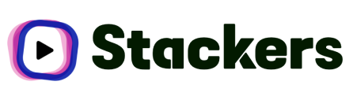

# Ⅰ. 서비스 소개

---

### 진행 기간

: 2023/01/09 ~ 2023/02/17 (39일)

<br/><br/>

### 개요

- **한줄 소개** : 숏폼을 활용한 합주 소셜 네트워크 서비스

- **서비스 명** : Stackers

- **배포 사이트** : https://www.stackers.site

<br/><br/>

### 타겟층

- 음악에 관심있는 사람들

- 숏폼 SNS를 즐기고 싶은 사람들

- 시공간의 제약과 높은 진입장벽으로 인해 합주가 어려운 사람들

- 다양한 악기들의 정보나 영상을 접하고 싶은 사람들

- 간단한 포트폴리오를 작성하고 싶은 뮤지션들

<br/><br/>

### 기획 배경

- #### 배경

  춤추고, 연주하고, 노래를 부르며 사람들은 음악을 다양한 방식으로 즐기고 표현한

  다. 음악은 인류의 만국 공통어라고 했던가, 어디서나 쉽게 접할 수 있고 깊은 사전지식이

  없어도 즐길 수 있다. 우리는 많은 사람들이 음악에 흥미를 보이고 취미로 삼고있음에도

  막상 그것을 표현할 수 있는 창구가 별로 없다는 생각이 들었다.

  음악은 혼자서도 즐길 수 있는 예술이지만, 예술이란 것은 결국 누군가 함께 해주지 않는

  다면 큰 의미를 갖지 못하기도 한다. 사람들이 함께 음악을 하고싶어해도 바쁜 현대 사회

  에 시간과 공간을 누군가와 공유하는 것은 큰 리스크로 다가오게된다. 이를 극복하기 위

  한 프로그램은 존재했다.

  - 공간의 제약을 극복한 싱크룸

    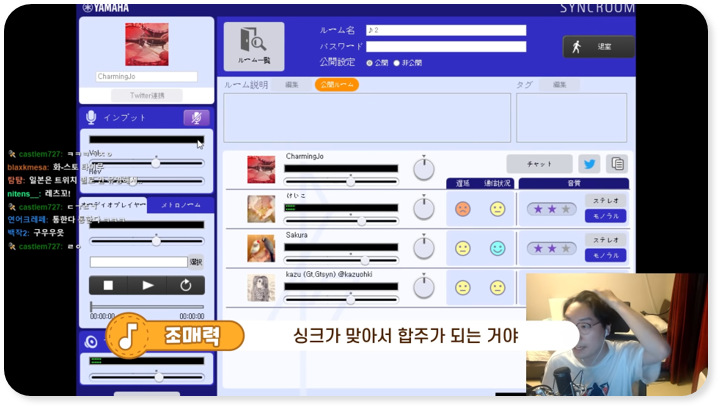

  - 시간의 제약을 극복한 자뮬러스

    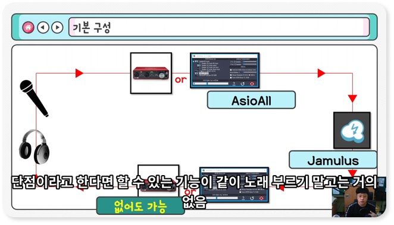

  하지만 결국 상당한 시간과 공간을 공유해야 하기도 하고, 사용하기 위해 장비가

  필요하는 등의 전문성을 요구해 진입장벽이 높다는 단점이 존재했다. 또한 일정 수준

  이상의 실력을 가지고 있지 않으면 사람들을 모으기 어려운 것은 당연지사다.

  우리는 이런 **시공간의 제약을 극복**하고 **다양한 사람들이 쉽게 접근**할 수 있는 음악

  서비스를 제공하고 싶었다.

- #### 목적

  `Stackers` 서비스를 통해,

  - 다양한 사람들이 **다양한 노래/악기**를 가지고 **쉽게 음악에 접근**

  - **웹캠을 사용**해 **손쉽게** 음악을 표현하고 즐길 수 있게 함

  - 음악을 즐기는 사람들의 **만남의 장소**를 제공함

  - 짧은 연습만으로도 **자유롭게 합주 참가**

  - 뮤지션들의 **자기PR**

  - 일반인들과 뮤지션의 합주 가능

<br/><br/>

### 주요 기능

- #### 스택 Stack

  : 영상을 쌓는 과정

- #### 스테이션 Station

  : Stack으로 인해 제작된 영상

- #### 스태커 Stacker

  : 영상을 쌓는 사람들

- #### 메인 룸

  - 이미 완성된 스테이션과 미완성된 스테이션을 볼 수 있어요

  - 인기있는 스테이션 순위를 볼 수 있어요

  - 현재 팔로잉하는 스태커의 스테이션을 볼 수 있어요

- #### 레코드 룸

  - 첫 스택으로 스테이션을 시작할 수 있어요

  - 마음에 드는 다른 스태커의 스테이션에 자신의 연주 쌓을 수 있어요

  - 녹화한 스테이션을 업로드 전에 필요한 정보를 기입할 수 있어요

- #### 스테이션 룸

  - 스테이션과 스테이션 설명, 이 스테이션에 참여한 사람들을 볼 수 있어요

  - 스테이션에 나의 반응을 좋아요와 댓글로 표현해보아요

  - 스태커의 스테이션들이 마음에 든다면 스태커를 팔로우할 수 있어요

- #### 스태커 룸

  - 알리고 싶은 나의 정보, 연주 악기, 소속그룹을 보여줄 수 있어요

  - 멋진 연주 사진을 추가하여 나만의 프로필을 만들어 보세요

  - 내가 쌓은 공개/비공개 스테이션을 모아 볼 수 있어요

  - 스태커가 쌓은 공개 스테이션을 모아 볼 수 있어요

- #### 검색

  - 스테이션 설명, 스테이션 곡 정보, 스태커 아이디, 닉네임으로 검색할 수 있어요

  - 쌓고 싶은 스테이션을 검색하고 스택을 쌓아보세요!

<br/><br/><br/><br/>

# Ⅱ. 기술 스택

---

### **아키텍쳐 구조도**

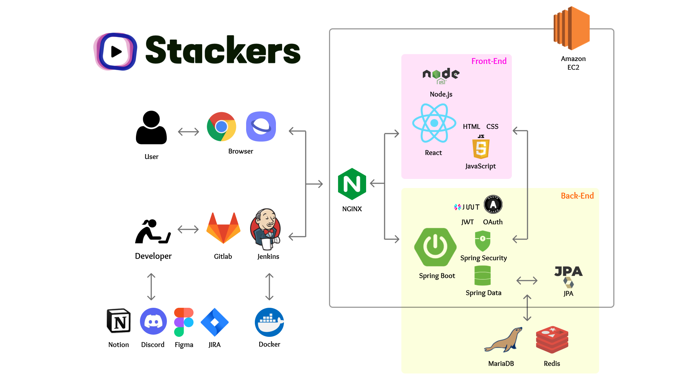

<br/><br/>

### Backend

- **IntelliJ IDEA** : v 2022.2.3

- **Java SE Development Kit**: v 17

- **Postman** : v10.9.4

- **Spring Boot** : v3.0.2

- **Spring Security** : v3.0.2

- **JWT** : v0.11.5

- **JPA** : v3.0.2

- **MariaDB** : v10.10.2

- **Redis** : v7.0.8

- **S3** : v2.2.6

- **Swagger** : v2.0.2

- **ffmpeg** (동영상, 이미지 파일 업로드를 위한 라이브러리) : v0.7.0

<br/><br/>

### Frontend

- **npm** : v 8.19.2

- **Node.js** : v 16.18.0

- **React** : v 18.2.0 (자동으로 최신버전 다운)

  - react-media-recorder (비디오 녹화 라이브러리)

  - react-dropzone (파일 드래그 앤 드롭 라이브러리)

  - react-router-dom (리액트 라우트 라이브러리)

  - react-redux (리액트 상태 관리 라이브러리)

  - moment (파일 저장 시간 정보 세팅을 위한 라이브러리)

- **VSCode** : v 1.74.3

- **MUI**

<br/><br/>

### CI/CD

- **AWS EC2**

- **AWS S3**

- **NGINX**

- **Docker**

- **GitLab**

<br/><br/>

### 프로젝트 구조

#### Back

```
backend/
├─ .gradle/
├─ .idea/
│  ├─ favicon.ico
│  ├─ index.html
│  ├─ manifest.json
│  ├─ robots.txt
├─ build/
├─ gadle/
├─ src/
│  ├─ main/
│  │  ├─ java/
│  │  │  ├─ com.ssafy.stackers/
│  │  │  │  ├─ auth/
│  │  │  │  ├─ config/
│  │  │  │  │  ├─jwt/
│  │  │  │  ├─ controller/
│  │  │  │  ├─ exception/
│  │  │  │  ├─ handler/
│  │  │  │  ├─ model/
│  │  │  │  │  ├─dto/
│  │  │  │  ├─ repository/
│  │  │  │  ├─ service/
│  │  │  │  ├─ utils/
│  │  │  │  │  ├─error/
│  │  │  │  │  ├─S3Uploader.java
│  │  │  │  ├─ StackersApplication
│  │  ├─ resources/
│  ├─ test/
│  │  ├─ java/
│  │  │  ├─ com.ssafy.stackers/
│  │  │  │  ├─ StackersApplicationTests.java
├─ .gitignore
├─ build.gradle
├─ gradlew.bat
├─settings.gradle
```

<br/><br/>

#### Front

```
frontend/
├─ node_modules/
├─ public/
│  ├─ favicon.ico
│  ├─ index.html
│  ├─ manifest.json
│  ├─ robots.txt
├─ src/
│  ├─ assets/
│  ├─ components/
│  │  ├─ account/
│  │  ├─ station/
│  ├─ pages/
│  │  ├─ main_room/
│  │  ├─ my_page/
│  │  ├─ profile_edit/
│  │  ├─ record_room/
│  │  ├─ searchview/
│  │  ├─ sign_folder/
│  │  │  ├─ LogIn/
│  │  │  ├─ SignUp/
│  │  ├─ station_room/
│  │  │  ├─ article/
│  │  │  ├─ assets/
│  │  │  ├─ comment/
│  │  │  ├─ stationview/
│  ├─ App.js
│  ├─ App.test.js
│  ├─ index.css
│  ├─ index.js
│  ├─ logo.svg
│  ├─ reportWebVitals.js
│  ├─ router.js
│  ├─ setupProxy.js
│  ├─ setupTests.js
│  ├─ store.js
├─ .gitignore
├─ package-lock.json
├─ package.json
├─ README.md
```

<br/><br/>

### 협업 툴, 규칙

- #### Git

  Git Branch

  ```
  master(main)

  develop

  feature
  ```

  feature 브랜치 작성

  - 전체 영어 소문자로

  - 예시)

    - `feature/back/login`

    - `feature/back/settings`

    - `feature/front/signup`

    - `feature/front/main-list`

  MR 요청시 back-end, front-end 별로 MR 요청한 본인을 제외한 다른 팀원이 코드 확인 후 MR 진행

- #### Notion

  **회의록**

  - Scrum meeting : 특이사항 있을 경우 작성

  - General meeting : 회의 주요 안건, 결과, 피드백 기록

  - Weekend meeting : 주말에 회의 시 기록

  **기능 명세 및 우선순위**

  - 우선순위가 기록되어 있는 요구사항 명세서 표

  **화면 설계**

  - 화면 설계도

  - 와이어프레임

  **레퍼런스 정리**

  **개발 공부 발자취 및 오류 로깅**

  **팀 규칙**

  **컨벤션**

  **개발 진척도 공유**

- #### JIRA

  - 매주 월~금요일에 진행할 Task 등록 후 Sprint 시작

  - **Epic, Story, Task 단위**

    - **Epic**

      - 기획, 설계, FE 개발, BE 개발, 배포, TEST, 발표

    - **Story**

      - 명세서 기능(사용자가 쓰는 기능 단위)을 기준으로 작성
      - 명사형

    - **Task**

      - Task는 최대한 상세하게 쪼개어서 작성할 것

      - 이름은 [ `BE` , `FE` ] 를 앞에 붙여서 명사형으로 작성하고 설명은 선택적으로 동사형으로 작성할 것

        ex) [BE] 유저 데이터베이스 추가

- #### MatterMost

  - 공지

  - 변동사항

  - 정보 공유

  - Gitlab 연동 알림

- #### Discord

  - 공지

  - 비대면 회의

    - 전체 회의

    - front-end 회의

    - back-end 회의

  - 정보 공유

  - front-end 정보 공유

  - back-end 정보 공유

<br/><br/>

### 역할

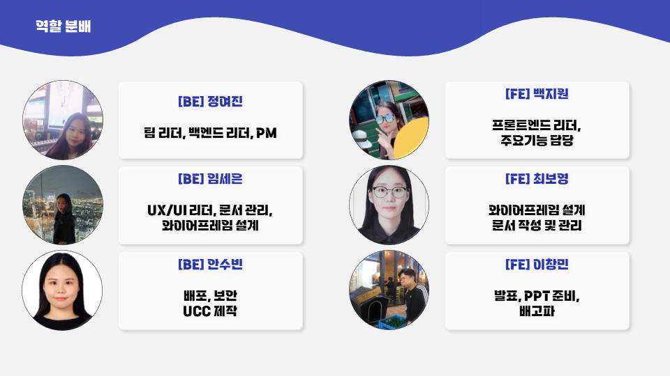

<br/><br/>

### 기능 명세서

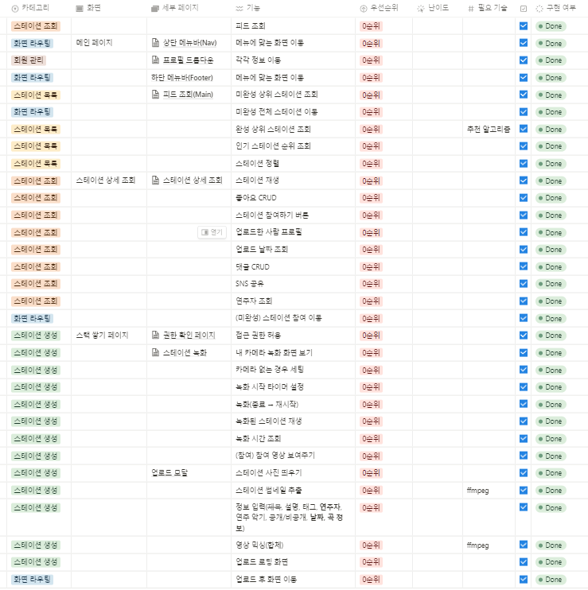

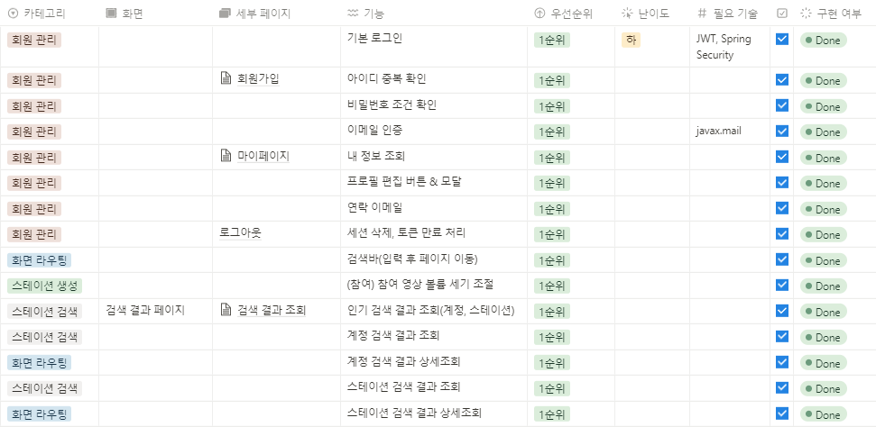

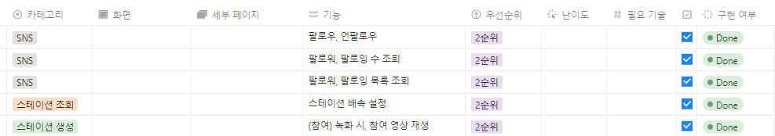

<br/><br/>

### 와이어프레임

- #### 초기 화면 설계도

  

- #### 와이어프레임

  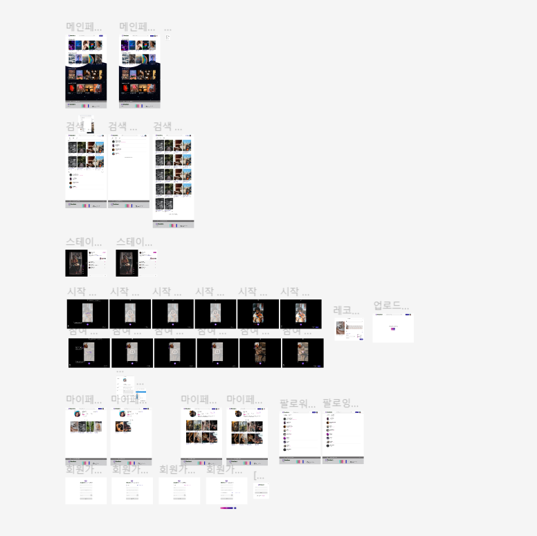
  https://www.figma.com/file/wtqO0vKJn3ErP4MrNboH5D/SSAFY--%EA%B3%B5%ED%86%B5%ED%94%84%EB%A1%9C%EC%A0%9D%ED%8A%B8?node-id=0%3A1&t=YKJovMbV8aYgmd2U-0

<br/><br/>

### ERD

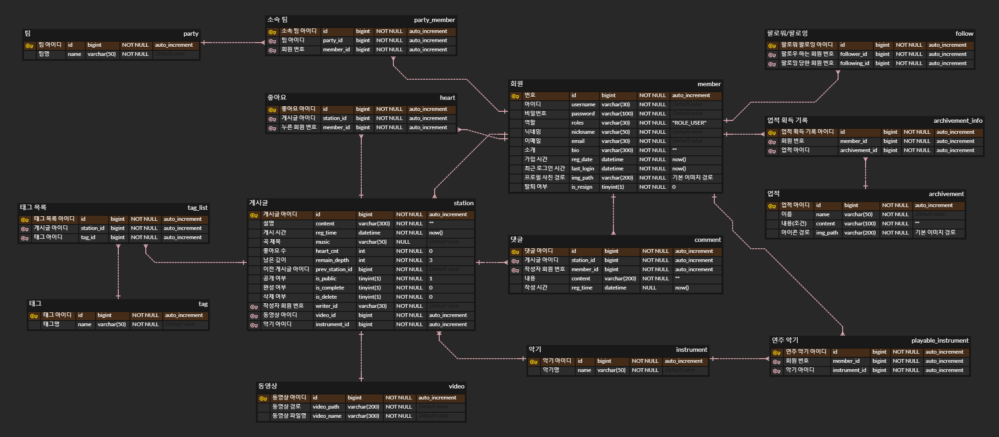
https://www.erdcloud.com/d/sRQQBLFuiSdbzekRN

<br/><br/>

### 배포

- exec 폴더의 포팅매뉴얼 참조

<br/><br/><br/><br/>

# Ⅳ. 프로젝트 결과

---

### 실제 서비스 화면


- 메인 룸

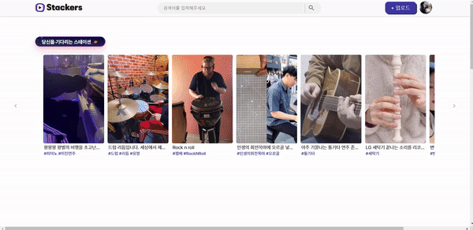
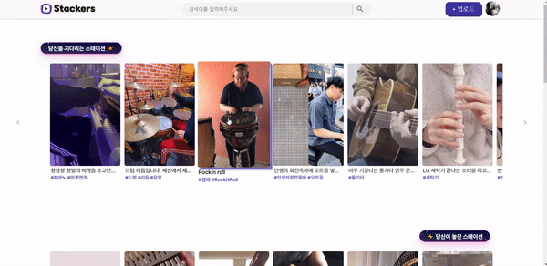

- 레코드 룸

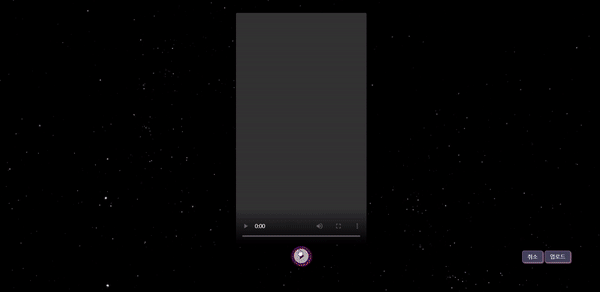


- 검색

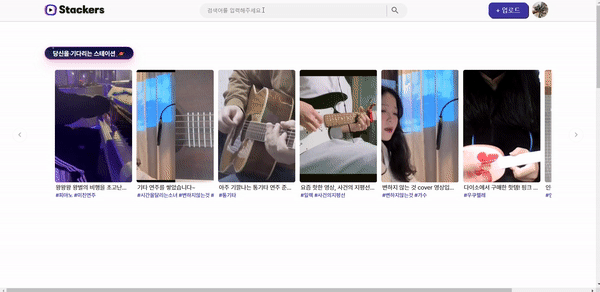

- 스테이션 룸

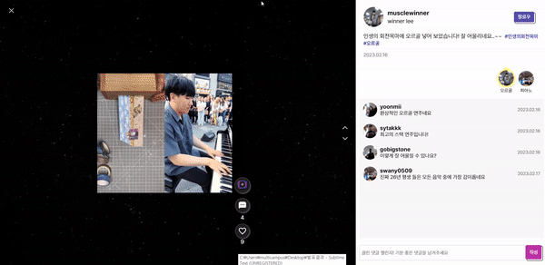

- 마이 룸

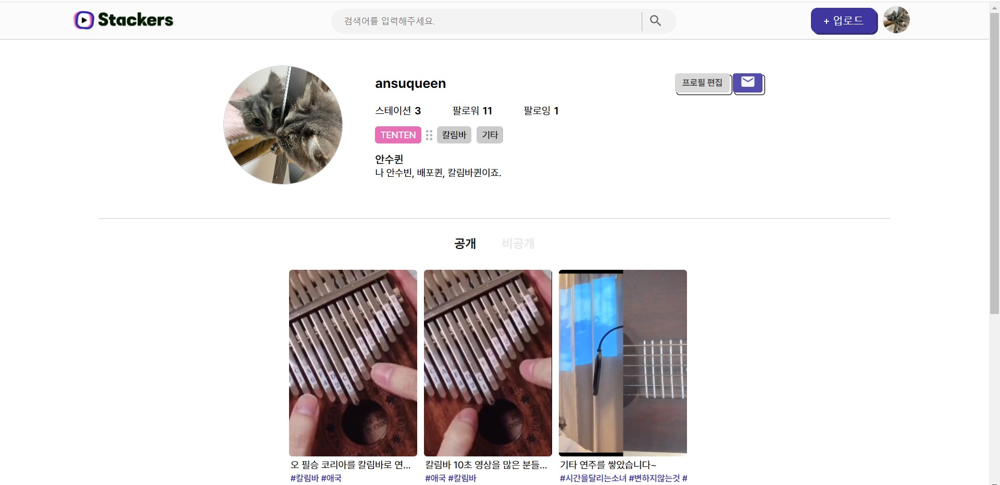

<br/><br/>

### 협업

- #### Git Flow

  

- #### Jira 번다운 차트 사진

  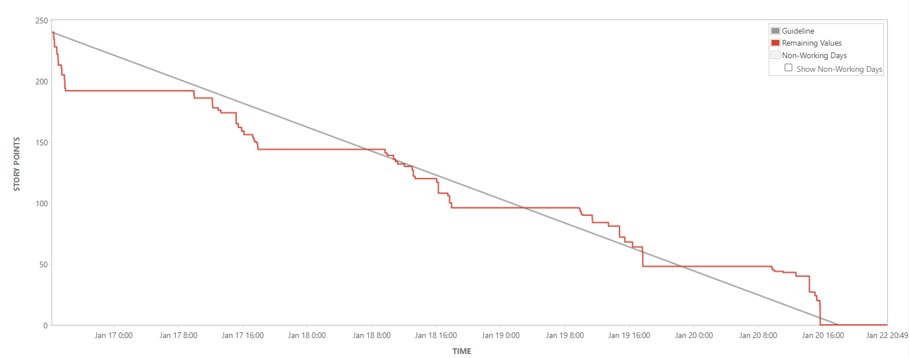
  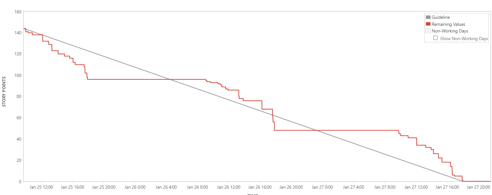
  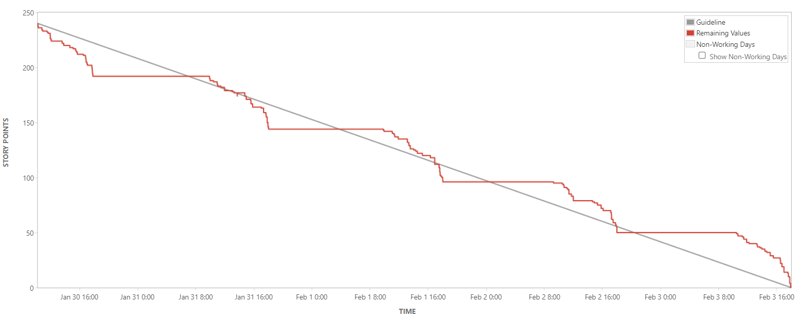
  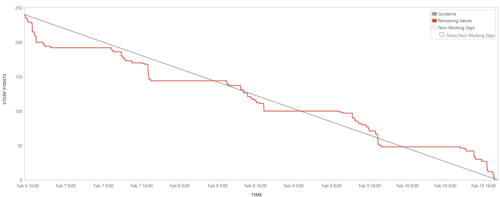
  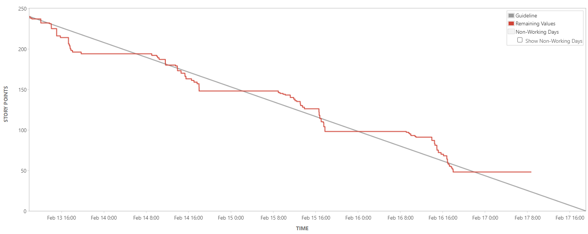
  https://ssafy.atlassian.net/jira/software/c/projects/S08P12C210/boards/1424

- #### Notion

  
  https://www.notion.so/20150924/7c581dcf01044128bca06a39b6856cd0

<br/><br/><br/><br/>

# Ⅴ. 소감 및 배운점

---

#### 정여진

> 팀장, PM으로서 많은 경험을 하게 된 프로젝트였습니다. ffmpeg를 사용해 동영상을 서버에 저장하고 가공하는 기술을 배우게 되었습니다. 그리고 협업능력도 키울 수 있던 시간이었던 것 같아요. PM으로서 Jira를 이용한 일정관리, 팀장으로서 프로젝트 전반적인 총괄과 다양한 경험이 되었습니다. 지금까지 잘 따라와준 팀원들 너무 고맙고, 고생많았습니다!  

#### 임세은

> Stackers의 기획과 개발을 함께하면서 백엔드 개발자로서의 입지를 다질 수 있었습니다. 프론트엔드 개발을 위주로 하다가 첫번째 백엔드 배포 프로젝트를 하게 되었는데 많은 지식이 부족함을 알았습니다. 매주 토요일 팀원들과 함께 스터디하며 실력이 키워졌고 앞으로 마주할 프로젝트들이 기대됩니다. 마지막으로 텐텐 팀원들에게 말하고 싶습니다. "고생했고 잘 했고 최고였다~~~"

#### 안수빈

> 팀원들과 기획부터 배포까지 할 수 있는 유익한 경험이었습니다. 
이번 공통 프로젝트를 통해서 개발 외의 다양한 경험을 할 수 있었습니다. 
주제 선정부터 기획, 컨벤션 설정, Jira, Notion 등 다양한 협업툴, 그리고 Docker를 사용하여 배포까지 진행했습니다.
개발만 해보다가 개발 외의 것들을 진행하니 어려움과 시행착오가 많았지만 이번 과정을 통해서 많이 성장할 수 있었습니다.
많은 성장을 할 수 있던 소중한 시간이었습니다. 감사합니다.

#### 이창민

> 제대로된 개발협업은 처음이라 배우는게 많은 시간이였습니다.  
> 프론트엔드는 코딩 실력이 뛰어나더라도 잘하는게 아니라는걸 알았습니다.
> 전체적인 틀, 디자인은 UI/UX가 매우 중요한 것을 느꼈고, 기획은 정말 세세하게 짜고, 시작해야한다는 것을 느꼈습니다.
> 개발과정에서 너무 어렵고 힘들었지만, 함께 해준 팀원들덕분에 끝가지 잘할 수 있었던거 같습니다.
> 텐텐과 함께여서 재밌었고, 많이 배우는 시간이였습니다.

#### 최보영

> 39일간의 프로젝트를 진행하면서 많은 것들을 얻고 가게 되었습니다. 특히 협업과 커뮤니케이션, 디자인 능력에서 성장할 수 있었습니다. 다양한 협업툴인 Jira, Notion, Figma를 이번 기회에 사용해 볼 수 있는 시간이 될 수 있었습니다. 문서 작성, 정리 담당으로서 팀원들에게 도움이 된 것이 뿌듯합니다. 처음 사용하는 React 프레임워크도 같이 공부하고 부족한 부분은 서로 도와주며 개발해서 좋았습니다. 능력자인 팀원들을 보며 저의 열정도 타올랐고 팀 분위기가 정말 좋아서 마지막까지 열정적으로 마무리할 수 있었습니다. 프로젝트를 마무리하고 흩어진다는게 아쉬울 정도입니다. 그만큼 짧은 시간동안 정말 하나의 팀인 된 듯 합니다. 함께해준 팀원들 모두 고마웠고 감사했습니다.

#### 백지원

> 이번 프로젝트를 통해 깃이나 지라등 협업툴 사용에 익숙해 질 수 있었고 컨벤션이나 상황보고 등, 협업방식에 대해 파악할 수 있는 시간이 될 수 있었습니다. 혼자라면 엄두도 못낼 프로젝트였지만 함께 제가 좋아하는 주제를 구현해나가는 과정은 정말 즐거웠습니다. 이번 프로젝트를 계기로 리액트 라이프 사이클, 자바스크립트의 비동기, 동기 방식에 대해 학습하고 익힐 수 있었습니다. 각자의 역할에 충실하며 부족한 부분은 서로 보완하며 협업의 장점을 톡톡히 느낄 수 있는 시간이었습니다. 고생한 팀원들에게 모두 고맙다는 말을 전하고 싶고 함께 열심히 할 수 있었단 사실이 뿌듯합니다. 감사합니다.
