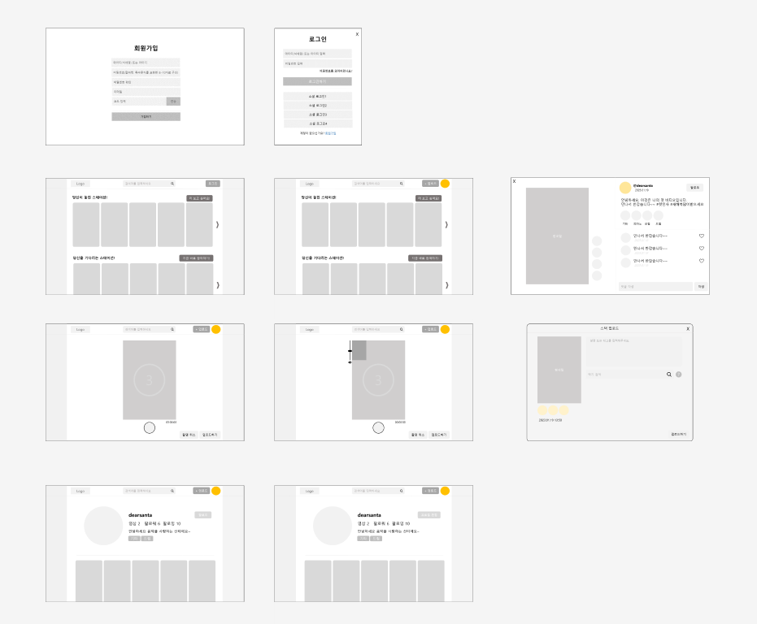

# Stackers


# Ⅰ. 서비스 소개

---

1. 진행 기간

2. 개요
   
   - 한줄 소개 : 온라인 합주 서비스
   
   - 서비스 명 : Stackers

3. 타겟
   
   - 악기 혹은 합주에 관심이 있는 사람들
   - 시간, 공간의 제약이 있는 경우 취미생활하기 어려운 사람들

4. 기획 배경
   
   - 배경
     
     > 노래 혹은 안기연주에 관심이 많은 사람들은 많다. 함께 연주를 해보고 싶기도 하고, 자신의 연주를 자랑하고 싶은 사람들도 있다. 하지만, 바쁜 현대인에게 이는 큰 제약조건이 된다.
   
   - 목적
     
     > `Stackers`는 각자 자유로운 공간에서, 언제든 연주 영상을 올릴 수 있는 기능을 제공합니다. 그리고, 연주 영상에 자신의 연주를 함께 녹화하는 기능을 제공합니다.
   
   - 의의

5. 주요 기능
- 악기 연주 영상(스테이션) 녹화 및 게시

- 마음에 드는 다른 사람의 스테이션에 자신의 연주 쌓기

- 완성된 스테이션, 참여 가능한 스테이션 조회

- 인기 영상 조회

- 영상에 좋아요, 댓글 작성, SNS 공유 가능

- 마음에 드는 연주자를 팔로우

- 마이페이지에서 바이오 및 연주 가능 악기, 소속 그룹 관리

- 게시물 설명, 곡 정보, 아이디, 닉네임 검색 기능으로 원하는 스테이션 및 계정 찾기

# Ⅱ. 기술 스택

---

## **아키텍쳐 구조도**


### Backend

- **IntelliJ IDEA** : v 2022.2.3

- **Java SE Development Kit**: v 17

- **Postman** : v10.9.4

- **Spring Boot** : v3.0.2

- **Spring Security** : v3.0.2

- **JWT** : v0.11.5

- **JPA** : v3.0.2

- **MariaDB** : v10.10.2

- **Redis** : v7.0.8

- **S3** : v2.2.6

- **Swagger** : v2.0.2

- **ffmpeg** (동영상, 이미지 파일 업로드를 위한 라이브러리) : v0.7.0

### Frontend

- **npm** : v 8.19.2

- **Node.js** : v 16.18.0

- **React** : v 18.2.0 (자동으로 최신버전 다운)
  
  - react-media-recorder (비디오 녹화 라이브러리)
  
  - react-dropzone (파일 드래그 앤 드롭 라이브러리)
  
  - react-router-dom (리액트 라우트 라이브러리)
  
  - react-redux (리액트 상태 관리 라이브러리)
  
  - moment (파일 저장 시간 정보 세팅을 위한 라이브러리)

- **VSCode** : v 1.74.3

- **MUI**

### CI/CD

- **AWS EC2**

- **AWS S3**

- **NGINX**

- **Docker**

- **GitLab**

### 프로젝트 구조

#### Back

```
backend/
├─ .gradle/
├─ .idea/
│  ├─ favicon.ico
│  ├─ index.html
│  ├─ manifest.json
│  ├─ robots.txt
├─ build/
├─ gadle/
├─ src/
│  ├─ main/
│  │  ├─ java/
│  │  │  ├─ com.ssafy.stackers/
│  │  │  │  ├─ auth/
│  │  │  │  ├─ config/
│  │  │  │  │  ├─jwt/
│  │  │  │  ├─ controller/
│  │  │  │  ├─ exception/
│  │  │  │  ├─ handler/
│  │  │  │  ├─ model/
│  │  │  │  │  ├─dto/
│  │  │  │  ├─ repository/
│  │  │  │  ├─ service/
│  │  │  │  ├─ utils/
│  │  │  │  │  ├─error/
│  │  │  │  │  ├─S3Uploader.java
│  │  │  │  ├─ StackersApplication
│  │  ├─ resources/
│  ├─ test/
│  │  ├─ java/
│  │  │  ├─ com.ssafy.stackers/
│  │  │  │  ├─ StackersApplicationTests.java
├─ .gitignore
├─ build.gradle
├─ gradlew.bat
├─settings.gradle
```

#### Front

```
frontend/
├─ node_modules/
├─ public/
│  ├─ favicon.ico
│  ├─ index.html
│  ├─ manifest.json
│  ├─ robots.txt
├─ src/
│  ├─ assets/
│  ├─ components/
│  │  ├─ account/
│  │  ├─ station/
│  ├─ pages/
│  │  ├─ main_room/
│  │  ├─ my_page/
│  │  ├─ profile_edit/
│  │  ├─ record_room/
│  │  ├─ searchview/
│  │  ├─ sign_folder/
│  │  │  ├─ LogIn/
│  │  │  ├─ SignUp/
│  │  ├─ station_room/
│  │  │  ├─ article/
│  │  │  ├─ assets/
│  │  │  ├─ comment/
│  │  │  ├─ stationview/
│  ├─ App.js
│  ├─ App.test.js
│  ├─ index.css
│  ├─ index.js
│  ├─ logo.svg
│  ├─ reportWebVitals.js
│  ├─ router.js
│  ├─ setupProxy.js
│  ├─ setupTests.js
│  ├─ store.js
├─ .gitignore
├─ package-lock.json
├─ package.json
├─ README.md
```

### 협업 툴, 규칙

- ##### Git
  
  Git Branch
  
  ```
  master(main)
  
  develop
  
  feature
  ```
  
  feature 브랜치 작성
  
  - 전체 영어 소문자로
  
  - 예시)
    
    - `feature/back/login`
    
    - `feature/back/settings`
    
    - `feature/front/signup`
    
    - `feature/front/main-list`
  
  MR 요청시 back-end, front-end 별로 MR 요청한 본인을 제외한 다른 팀원이 코드 확인 후 MR 진행

- ##### Notion
  
  **회의록**
  
  - Scrum meeting : 특이사항 있을 경우 작성
  
  - General meeting : 회의 주요 안건, 결과, 피드백 기록
  
  - Weekend meeting : 주말에 회의 시 기록
  
  **기능 명세 및 우선순위**
  
  - 우선순위가 기록되어 있는 요구사항 명세서 표
  
  **화면 설계**
  
  - 화면 설계도
  
  - 와이어프레임
  
  **레퍼런스 정리**
  
  **개발 공부 발자취 및 오류 로깅**
  
  **팀 규칙**
  
  **컨벤션**
  
  **개발 진척도 공유**

- ##### JIRA
  
  - 매주 월~금요일에 진행할 Task 등록 후 Sprint 시작
  
  - **Epic, Story, Task 단위**
    
    - **Epic**
      
      - 기획, 설계, FE 개발, BE 개발, 배포, TEST, 발표
    
    - **Story**
      
      - 명세서 기능(사용자가 쓰는 기능 단위)을 기준으로 작성
      - 명사형
    
    - **Task**
      
      - Task는 최대한 상세하게 쪼개어서 작성할 것
      
      - 이름은 [ `BE` , `FE` ] 를 앞에 붙여서 명사형으로 작성하고 설명은 선택적으로 동사형으로 작성할 것
        
        ex) [BE] 유저 데이터베이스 추가

- ##### MatterMost
  
  - 공지
  
  - 변동사항
  
  - 정보 공유
  
  - Gitlab 연동 알림

- ##### Discord
  
  - 공지
  
  - 비대면 회의
    
    - 전체 회의
    
    - front-end 회의
    
    - back-end 회의
  
  - 정보 공유
  
  - front-end 정보 공유
  
  - back-end 정보 공유

### 역할

- 사진, 이름, 역할을 넣은 이미지 또는 pdf 넣기

### 기능 명세서


### 와이어프레임

- 초기 화면 설계도
  
  

- 와이어프레임
  
  

### ERD


### 배포

- 배포퀸 님 작성해주세요..

# Ⅳ. 프로젝트 결과

--- 

### 실제 서비스 화면 (시나리오 순서와 같게 gif 로?)

- 회원가입

- 로그인

- 메인

- 검색(상세조회로 이동, 참여하기 버튼 클릭)

- 상세조회(팔로우, 팔로잉, 댓글 달기, 마이페이지 이동)

- 마이페이지(프로필 편집, 팔로잉, 팔로우 리스트 확인, 공개/비공개 영상)

### 협업

- ##### Git Flow
  
  

- ##### Jira 번다운 차트 사진
  
  - 마지막날에...

- ##### Notion
  
  

# Ⅴ. 소감 및 배운점

---

##### 정여진

##### 임세은

##### 안수빈

##### 이창민

##### 최보영

##### 백지원
